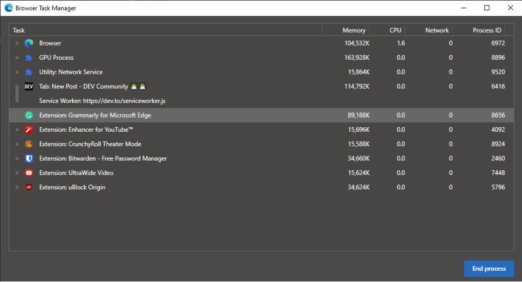
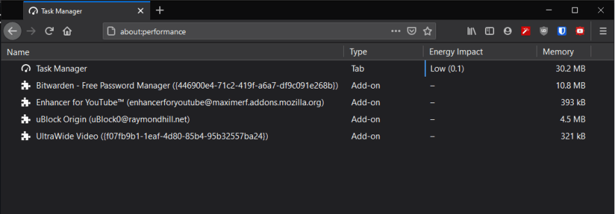
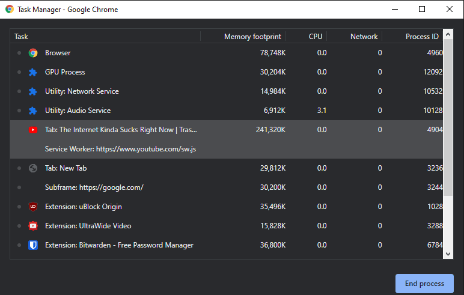

+++
title="TIL: Browsers have their own task managers"
description="Browsers have their own task managers"
date=2020-08-08

[taxonomies]
tags = ["tech", "browser"]
categories = ["technology"]

[extra]
ToC = true
+++

# Today I found out something amazing
So I opened my discord, as one does when they get on their computer. And there was a prompt saying press `Shift + ESC`. I couldn't read what it was for, but I decided to give it a shot thinking it must be some newly added feature. 

> Am I over-reacting? How many people know about this?

#### Anyway here are some screenshots.

- edge

---

So I thought if the edge has it, other browsers might also have this feature, and I googled a bit. 

---

- firefox

---

- chrome

Now, we can see how much extensions affect browser performance. For sure, I am going to use these tools to determine what extensions are worth it.

Hope you enjoyed learning something new! 💖