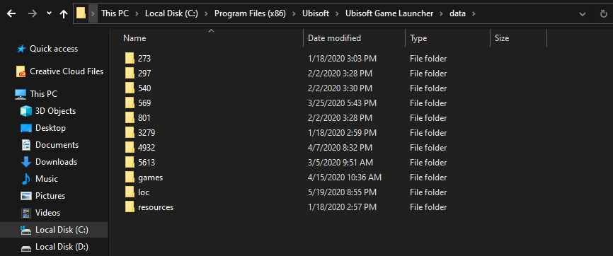

+++
title="A simple way to find installed games' uPlay IDs with python"
description="find uplay ids"
date=2020-06-23

[taxonomies]
tags = ["gaming"]
categories = ["tech", "programming"]

[extra]
ToC = true
+++

---

First we need to find where and how ***ubisoft*** keeps track of the games installed by `uPlay`.

After some digging and asking around, I was able to find that there are two ways of acquiring this data.

## First way :: extracting info from folders

* uPlay makes these folders, which are named after the __uplayID__ itself

> C:\\Program Files (x86)\\Ubisoft\\Ubisoft Game Launcher\\data

**The names of the folders are the uPlay IDs of the installed games**



### Below is the python code for extracting IDs via these folders

```py
import winreg, os, re

# Finding Uplay IDs by going through the uPlay data folder
def getUplayIDs(filePath = 'C:\\Program Files (x86)\\Ubisoft\\Ubisoft Game Launcher\\data'):
    listOfFiles = os.listdir(filePath)

    def findIDs():
        result = re.findall(r'\d+', str(entry))
        try : return result[0]
        except : pass

    for entry in listOfFiles:
        uPlayID = findIDs() # '\d' finds any number (a digit)
        if uPlayID != None : print(uPlayID)
```

## Second way :: extracting info from Windows Registry

```py
def getUplayIDs():
    # ubisoftGameList = {}

    baseReg = winreg.ConnectRegistry(None, winreg.HKEY_LOCAL_MACHINE)
    subKey = winreg.OpenKey(baseReg, "SOFTWARE\\WOW6432Node\\Ubisoft\\Launcher\\Installs\\")

    for i in range(50) :
        try :
            gameId = winreg.EnumKey(subKey,i)

            gameNameKey = winreg.OpenKey(baseReg, "SOFTWARE\\WOW6432Node\\Ubisoft\\Launcher\\Installs\\" + gameId + "\\")
            name = winreg.EnumValue(gameNameKey, 1)

            path = name[1]
            path = os.path.dirname(path)
            gameName = os.path.basename(path)

            print('\nThe Game name is: ' + gameName + ' \nThe Game ID is: ' + gameId)
            
        except :
            pass

    winreg.CloseKey(baseReg)
```

These code snippets are taken from my github project :: **Plei** 

It is a game-launcher which parses through the games installed by 

- Steam
- uPlay
- Origin
- Epic Games

and let's you play them from one single entry point


If you wish to contribute or download the project visit the link below

[github/plei](https://github.com/sakshatshinde/Plei)
