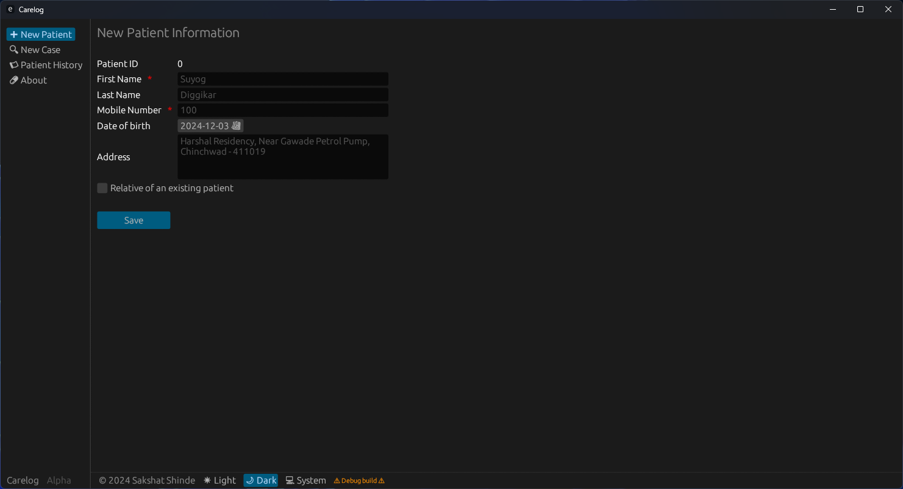

+++
title="portfolio"
description="the stuff that I create"

[extra]
date=2024-12-03
+++

#### Tokei

Your ultimate window to all things anime

Screenshots

---

#### Carelog

A simple patient data store built with SQLite, Rust and EGUI

Screenshots

---

#### [Jinjja](https://jinjja.pages.dev/)

Find the best products for your cash

Screenshots

---

#### argus

A storage monitoring tool for CDAC's High Performance Computing systems

Screenshots

## 

### Technical skills

`Python` `Rust` `Solution Architecture` `SQL` `Linux` `Docker`\
`Firebase` `Oracle DB` `Streamlit` `APIs` `Groovy` and `Grafana`

### Other Skills

`Product design` `Requirement gathering` `Agile` `Scrum` `Kanban` `Jira`\
`Trello` `Microsoft Office` `Figma` and `Adobe XD`

### Professional experience

Sr. System Analyst\
Amdocs `Aug 2021 – Present`

- Streamlined a high-toil workflow by creating a sophisticated development tool using Rust and Python. This
  advancement reduced the time needed for implementing complex business logic by 75%, resulting in a
  significant time savings of at least 2 days per month for each team across multiple departments
- Oversaw, evaluated and architected solutions that leverage capabilities of our product offerings (Uverse,
  DirecTV) for AT&T US – cutting down 15-20% of required scrum effort dramatically increasing velocity
- Implemented product roadmaps by translating business requirements into engineering tasks leveraging Agile
  methodologies
- Collaborated with cross-functional teams to understand their requirements and built a high-performance
  middleware platform, which acts as a REST API layer significantly improving developer productivity

Research Intern\
Center for Development of Advanced Computing (MeitY - Gov. Of India) `Mar 2020 – Jan 2021`

- Developed an information gathering & visualization tool for CDAC’s HPC system leveraging firebase and
  Grafana
- Produced research output to help provide an insight into the bottlenecks of I/O subsystems in high-
  performance computing
- Architected an efficient way to extract performance metrics with minimal overhead
