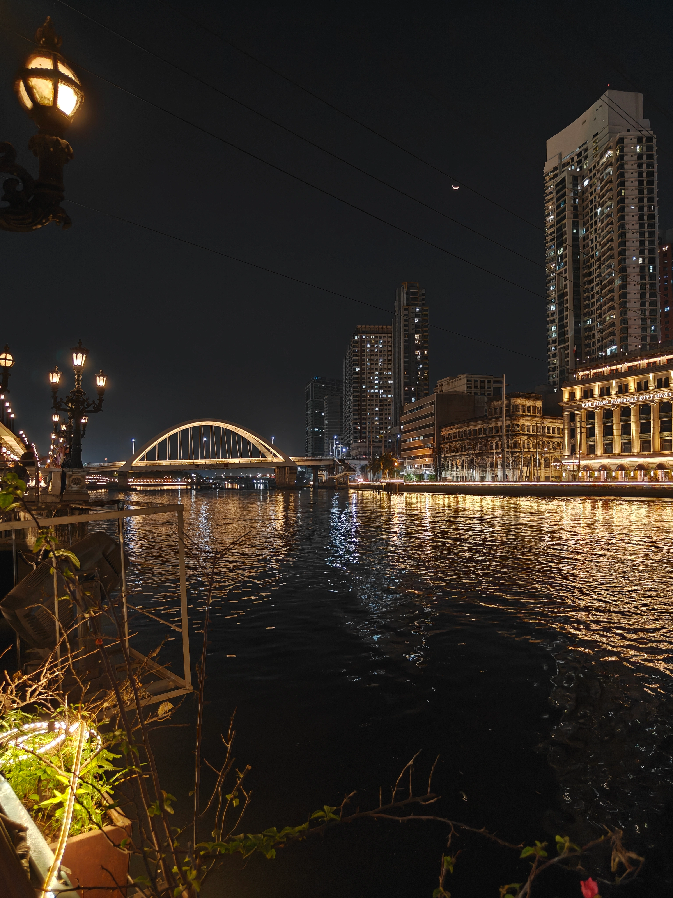
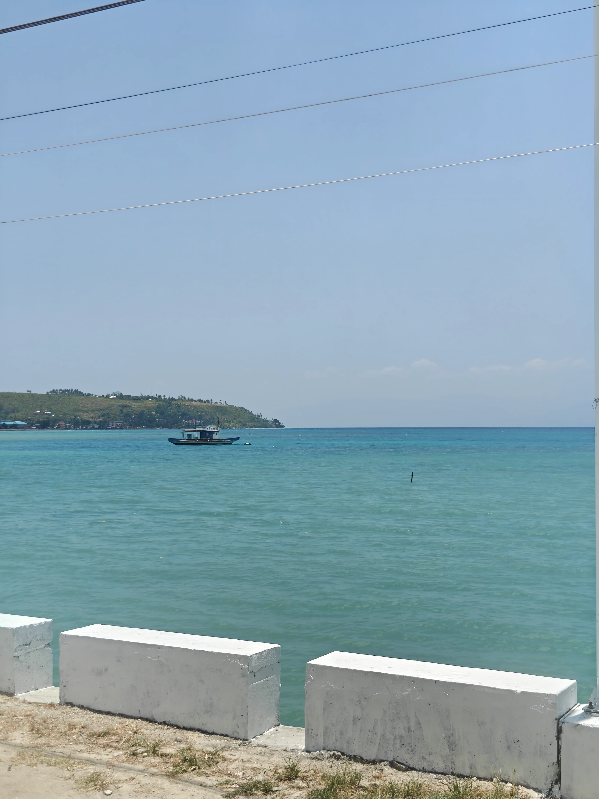
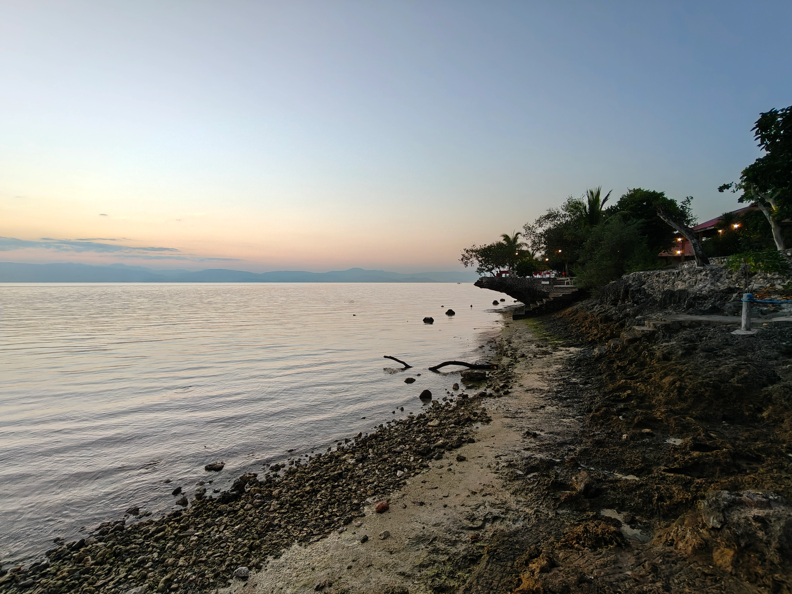
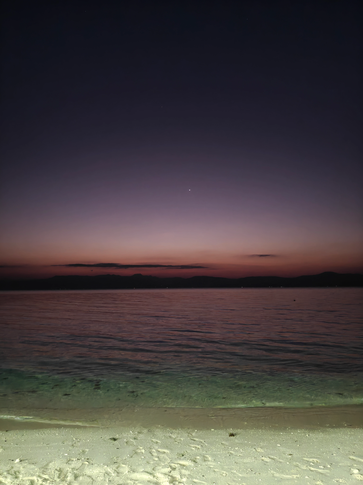
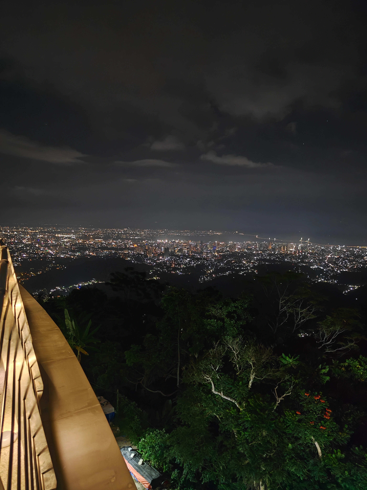

If I had to describe this trip: it was absolutely chaotic. Questionable decisions were made, mixed in with absolutely **ZERO** research (not a norm for us, I guess we are getting old) and filled with a lot of waiting and moving around. But eventually we had some great experiences, and tried something totally new! 

Before I talk more about our Philippines 🇵🇭 adventure with Sujit and Ankit, I'd like to chat about how we cheated a bit and took a layover at Malaysia 🇲🇾 of about `10h` - and since all of us are a bit unhinged we decided that it'd be a great idea to enter Malaysia at around `21:00` and somehow make it to the KL Tower and come back before our flight leaves the next morning.

> Might not have been the greatest idea

## So KL @ 00:00, what could go wrong?
As we have been to KLIA and KL before, things were familiar. We knew we wanted to take a bus ride to KL Sentral and it was only `21:30` so we were optimistic. We went to the bus ticket kiosk at the ground level at KLIA terminal 2, _without exchanging any money as we had our visa/mastercard and didn't want to pay airport tax for a couple of bus rides._

We reach there, and the machines were not really working. One of them was completely busted and was missing a POS. So we chose to get in line and get the ticket from the counter - to our surprise these counters told us that we can only pay with a card if we wait till `22:30`. Well we didn't really have a choice so waited until then. 

Finally we reach at KL Sentral, and everything is closed. It was almost midnight, the route usually takes an hour of travel so we expected that we will arrive late and some shops might be already closed up but well its Kuala Lumpur - such a lively city! Surely there must be something going on  and its a weekend at that.

Oh boy how wrong we were to assume that, for context we had visited KLCC in 2024 and were out and about till `03:00` everyday, and it was super fun! But this time everything was closed shut at midnight. The only store that was open was a small 7/11. At this point we realized that something is off - probably its best to get back to the airport because there is literally no one except few drunkards and police.

Now remember how our wise group decided not to get cash at the airport... well turns out 7/11 only accepted cash after `22:00`, and we had none. Originally we planned that we would get a sim and come back via grab and now we can't buy a sim, we can't buy a bus ticket or even water!

A local tried to help us there after hearing our conversation with the cashier - but he was an expat too and didn't have cash. To the people who are reading that and screaming internally why don't you use an ATM???

Well we tried. And it didn't work. The local (who was an expat) also tried and it didn't work. Calling him a local is a stretch, he looked like he was a student who had just moved. He didn't have cash, nor his card worked. 

After roaming around for a while, we decided to try once with Sujit's IndusInd Tiger CC - which by the way didn't even have international usage turned on, but it magically worked!!!

We finally took a sigh of relief that we could atleast get a bus ride back to KLIA and not miss our flight. By now its `03:30`. Me and Sujit were happy, Ankit was sad because he couldn't see the twin towers. But oh well atleast we are not missing our flight.

The buses at KL Sentral start back up at 3 am for people who are wondering. So we got the tickets and went back to the airport. We had the courage to do all this, because Malaysian Airlines was holding our luggage for us, now I wish they hadn't.

---

Onto the Philippines!

## Hello Cebu :)

`View outside of our stay, Lapu-Lapu City`

<small>© 2026 Sakshat Shinde. All Rights Reserved.</small>

## BGC Ghosttown

The only place in Manila that looked remotely lively... 

`Pasig River Esplanade`

<small>© 2026 Sakshat Shinde. All Rights Reserved.</small>
## Moalboal

Moalboal was definitely the peak of this trip.

`Just a random stop - way to Moalboal`

<small>© 2026 Sakshat Shinde. All Rights Reserved.</small>

`We got lost? Thanks google maps - this is not the white beach`

`Calm at the beach`

<small>© 2026 Sakshat Shinde. All Rights Reserved.</small>

## Back to Cebu

`TOP of Cebu`

<small>© 2026 Sakshat Shinde. All Rights Reserved.</small>

---

## How much did it cost?

**Hands down the cheapest possible flight we are ever gonna come across in our entire lifetime, BOM - CEB**

Considering our track record, we out did ourselves on this one. I believe Sujit mentioned one time to me that we traveled at `₹1.3/km` ($1 = ₹93 Apr 2026), cheaper than an EV btw.

At the same time we **overpaid** for our domestic flights :c

---

#### Flights

International Flights
| Route | Flight | Aircraft |
|---------|---------|---------|
| Mumbai (BOM) → Kuala Lumpur (KUL) | MH175 | Boeing 737 MAX 8 |
| Kuala Lumpur (KUL) → Cebu (CEB) | FY3692 | Boeing 737-800 |
| Cebu (CEB) → Kuala Lumpur (KUL) | FY3693 | Boeing 737-800 |
| Kuala Lumpur (KUL) → Mumbai (BOM) | MH194 | Airbus A330-300 |

Domestic Philippines Flights
| Route | Flight | Aircraft |
|---------|---------|---------|
| Cebu (CEB) → Manila (MNL) | Z2 764 | Airbus A320-216 |
| Manila (MNL) → Cebu (CEB) | Z2 763 | Airbus A320-216 |

 
Flight Cost Summary

| Traveler | Total |
|-----------|------:|
| Sakshat | ₹23,307 |
| Ankit | ₹24,305 |
| Sujit | ₹23,548 |

> **Trip flight spend for the group**: `₹71,160`

---

#### Airbnbs that we stayed at

- `Manila (3N)`
**Tower G, St. Mark, McKinley Hill**  1634 Venezia Drive, McKinley Hill, Taguig, Metro Manila, Philippines

- `Cebu (1N)`
**Saekyung 956 Condominium**  17th Floor, Building 101, Caltex Road, Looc, Lapu-Lapu City, Central Visayas 6015, Philippines

- `Moalboal (2N)`
**East Haus**  Sioux, Moalboal, Central Visayas 6032, Philippines

- `Cebu (2N)`
**Bloq 2, Unit 1509**  318 Sikatuna Street, Cebu City, Central Visayas 6000, Philippines

 
Cost Summary

| Item | Amount (8 Nights)|
|------|-------:|
| Total Accommodation Cost | ₹23,585 |
| Cost Per Person | ₹7,862 |

> **A detailed cost-sheet has been attached here:** [Sujit is still working on it](/404)

---

This is still not complete...

