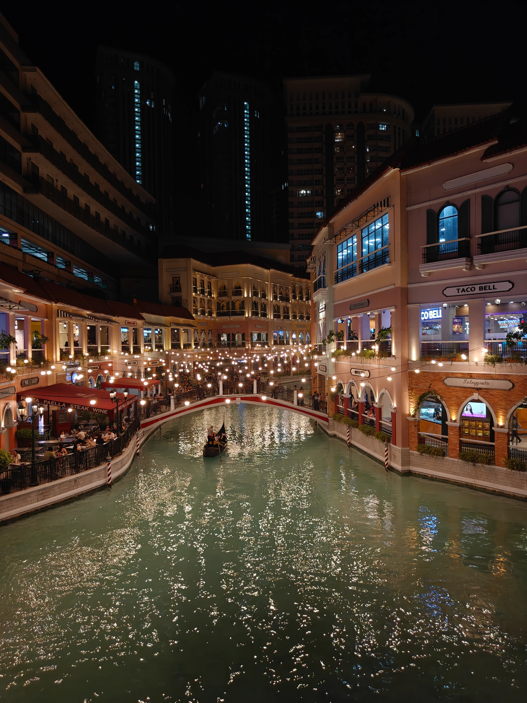
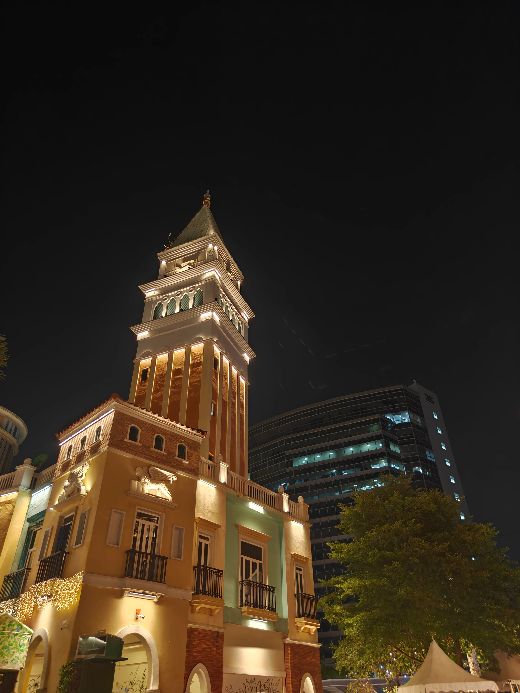
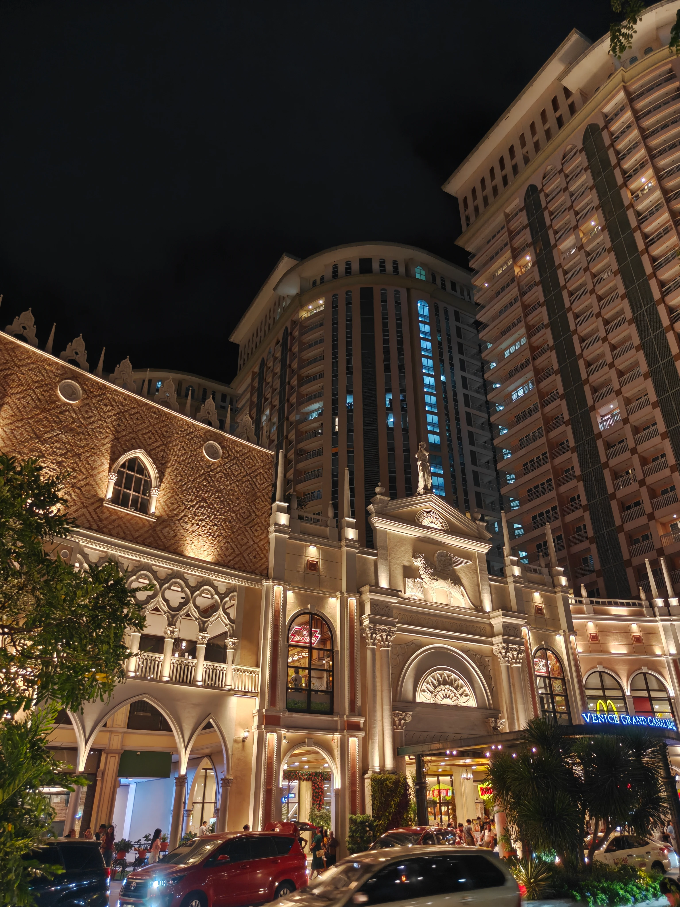
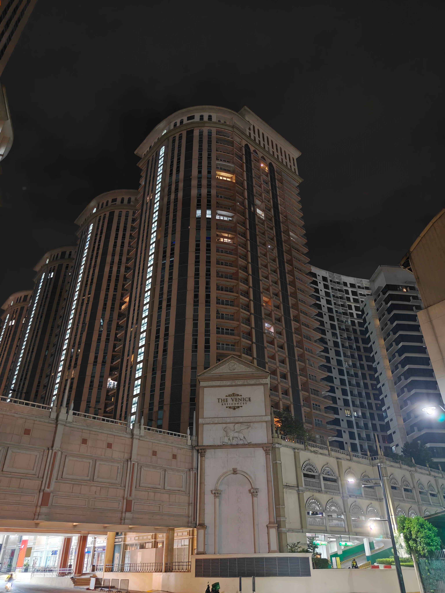

If I had to describe this trip, I'd call it absolutely **chaotic**. Questionable decisions were made, mixed in with absolutely **ZERO** research (not a norm for us) and filled with a lot of waiting and moving around. But eventually we had some great experiences, and tried something totally new! 

Before I talk more about our Philippines 🇵🇭 adventure with Sujit and Ankit, I'd like to chat about how we cheated a bit and took a layover in Malaysia 🇲🇾 of about `10h` - and since all of us are a bit unhinged we decided that it'd be a great idea to enter Malaysia at around `21:00` and somehow make it to the KL Tower and come back before our flight leaves the next morning.

> Might not have been the greatest idea

## So KL @ 00:00, what could go wrong?
As we have been to KLIA and KL before, things were familiar. We knew we wanted to take a bus ride to KL Sentral and it was only `21:30` so we were optimistic. We went to the bus ticket kiosk at the ground level at KLIA terminal 2, _without exchanging any money as we had our visa/mastercard and didn't want to pay airport tax for a couple of bus rides._

We reached there, and the machines were not really working. One of them was completely busted and was missing a POS. So we chose to get in line and get the ticket from the counter - to our surprise the staff at the counters told us that we could only pay with a card if we waited until `22:30`. Well we didn't really have a choice so waited until then. 

Finally, we reached KL Sentral, and everything was closed. It was almost midnight, the route usually takes an hour of travel so we expected that we would arrive late and some shops might already be closed, but well, it's Kuala Lumpur - such a lively city! Surely there must be something going on  and its a weekend at that.

Oh boy, how wrong we were to assume that. For context, we had visited KLCC in 2024 and were out and about till `03:00` everyday, and it was super fun! But this time everything was closed shut at midnight. The only store that was open was a small 7-Eleven. At this point we realized that something is off - probably its best to get back to the airport because there is literally no one except few drunkards and police.

Now remember how our wise group decided not to get cash at the airport... well turns out 7-Eleven only accepted cash after `22:00`, and we had none. Originally, we had planned to get a SIM and come back via Grab, and now we couldn't buy a SIM, a bus ticket, or even water!

A local tried to help us there after hearing our conversation with the cashier - but he was an expat too and didn't have cash. To the people reading this and screaming internally, "Why didn't you use an ATM???"

Well we tried. And it didn't work. The local (who was an expat) also tried and it didn't work. Calling him a local is a stretch, he looked like he was a student who had just moved. He didn't have cash, nor did his card work. 

After roaming around for a while, we decided to try once with Sujit's IndusInd Tiger CC - which by the way didn't even have international usage turned on, but it magically worked!!!

We finally took a sigh of relief that we could atleast get a bus ride back to KLIA and not miss our flight. By now its `03:30`. Sujit and I were happy; Ankit was sad because he couldn't see the twin towers. But oh well atleast we are not missing our flight.

The buses at KL Sentral start back up at 3 am for people who are wondering. So we got the tickets and went back to the airport. We had the courage to do all this, because Malaysian Airlines was holding our luggage for us, now I wish they hadn't.

---

Onto the Philippines!

## Hello Cebu :)

We arrived in Cebu for the first day of our trip, got in a Grab, and went straight to our first Airbnb which was pretty great. It was at a remote location in Lapu-Lapu city near a dock and it had an amazing view. Back in Mumbai, we were at Marine Drive and wondered if our hotel would have a similar view; turns out it was 10x better because of the ships!

Since it was our first day and we didn't really have anything planned we just goofed around, roamed a bit in the evening and stayed up until `2:00` in the morning talking about life on the balcony. Looking back, I really enjoyed that day, it wasn't full of activities or we didn't go to any place special but it felt really good and the calm was real and the view at night was surreal. Even as I type this I wish I could just go back and enjoy that scene one more time, could never get enough of it.

Well as a side-note, when you get off at the airport, just near the exit you'd see the counters for SIMs - we would recommend sticking to Smart. It's not worth the hassle to do all the registration that is needed to be done just after you land. We just got one SIM for the time being and used that for our needs for day one.

<small>Lapu-Lapu City © 2026 Sakshat Shinde. All Rights Reserved.</small>

---

## BGC Ghost town

On the second day of our trip, we reached Manila. From the airport to our stay, we took a Grab and the roads were packed. The traffic was icky, just like back home. The contrast was real from Lapu-Lapu. The city looked lively, and we saw a real jeepney for the first time - looked cool and unsafe. 

When we reached our hotel, there was literally no one there. We just thought that people might be at work since it was midday and shrugged it off. We got back to our rooms—with another great view of Grand Venice Mall and were able to spot airplanes every few mins, as it was close to the airport. We lucked out with our stay (or so we thought...)

That night we went to the mall, and it was pretty packed. I really liked the design and the little river channel that they made in within the mall was quite beautiful to look at. It genuinely looked like a movie set; the lighting was great, and it was perfect for taking some pictures.

<small>Inside Grand Venice Mall © 2026 Sakshat Shinde. All Rights Reserved.</small>

Now this is cool and all but do you notice something weird in that picture? Look at the apartments right behind the mall. This was the first time that we noticed that the buildings in the area looked abandoned. See if you can spot what we felt in the photos.

<small>Grand Venice Mall © 2026 Sakshat Shinde. All Rights Reserved.</small>

<small>Entrance of Grand Venice Mall © 2026 Sakshat Shinde. All Rights Reserved.</small>

Behold our hotel at night

<small>St. Mark, The Venice Residences BGC © 2026 Sakshat Shinde. All Rights Reserved.</small>

Well, after that for the night we went to 5th Avenue, 26th Street & 32nd Street they were the same. There was some office crowd waiting to go home but that was about it. It seems staying in BGC was a mistake and we would not recommend anyone to choose this as their stay in Manila. Makati or Pasay Bay area would've been a better choice for us.

We looked up online to see where we should visit, and ended up renting a scooter (crazy to do this in Manila btw, please don't do this). Finally we went to Pasig river. The only place in Manila that looked remotely lively.

<small>Pasig River Esplanade © 2026 Sakshat Shinde. All Rights Reserved.</small>

Manila (or rather, the parts we saw) did not live up to the hype; we would skip it if we visited the Philippines again. On the bright side, Ankit and I did get our Smart SIM cards for a reasonable price so it wasn't a total waste, and off-course the wild scooter rides in the Manila traffic were once in a lifetime experience.

---

## Moalboal

Moalboal was definitely the peak of this trip.

<small>Just a random stop - way to Moalboal © 2026 Sakshat Shinde. All Rights Reserved.</small>

<small>We got lost? Thanks google maps - this is not the white beach © 2026 Sakshat Shinde. All Rights Reserved.</small>

<small>Calm at the beach © 2026 Sakshat Shinde. All Rights Reserved.</small>

## Back to Cebu

<small>TOP of Cebu © 2026 Sakshat Shinde. All Rights Reserved.</small>

---

## How much did it cost?

**Hands down the cheapest flight we are ever going to come across in our entire lifetime: BOM - CEB**

Considering our track record, we outdid ourselves on this one. I believe Sujit mentioned once that we traveled at `₹1.3/km` ($1 = ₹93 Apr 2026), cheaper than an EV btw.

At the same time we **overpaid** for our domestic flights :c

---

#### Flights

International Flights
| Route | Flight | Aircraft |
|---------|---------|---------|
| Mumbai (BOM) → Kuala Lumpur (KUL) | MH175 | Boeing 737 MAX 8 |
| Kuala Lumpur (KUL) → Cebu (CEB) | FY3692 | Boeing 737-800 |
| Cebu (CEB) → Kuala Lumpur (KUL) | FY3693 | Boeing 737-800 |
| Kuala Lumpur (KUL) → Mumbai (BOM) | MH194 | Airbus A330-300 |

Domestic Philippines Flights
| Route | Flight | Aircraft |
|---------|---------|---------|
| Cebu (CEB) → Manila (MNL) | Z2 764 | Airbus A320-216 |
| Manila (MNL) → Cebu (CEB) | Z2 763 | Airbus A320-216 |

 
Flight Cost Summary

| Traveler | Total |
|-----------|------:|
| Sakshat | ₹23,307 |
| Ankit | ₹24,305 |
| Sujit | ₹23,548 |

> **Trip flight spend for the group**: `₹71,160`

---

#### Airbnbs that we stayed at

- `Manila (3N)`
**Tower G, St. Mark, McKinley Hill**  1634 Venezia Drive, McKinley Hill, Taguig, Metro Manila, Philippines

- `Cebu (1N)`
**Saekyung 956 Condominium**  17th Floor, Building 101, Caltex Road, Looc, Lapu-Lapu City, Central Visayas 6015, Philippines

- `Moalboal (2N)`
**East Haus**  Sioux, Moalboal, Central Visayas 6032, Philippines

- `Cebu (2N)`
**Bloq 2, Unit 1509**  318 Sikatuna Street, Cebu City, Central Visayas 6000, Philippines

 
Cost Summary

| Item | Amount (8 Nights)|
|------|-------:|
| Total Accommodation Cost | ₹23,585 |
| Cost Per Person | ₹7,862 |

> **A detailed cost-sheet has been attached here:** [Sujit is still working on it](/404)

---

This is still not complete...

