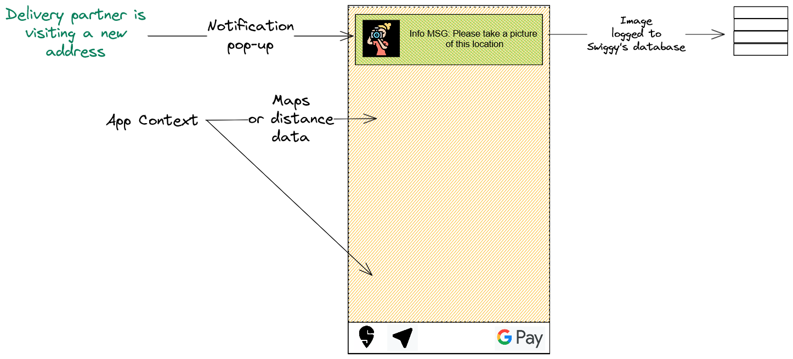
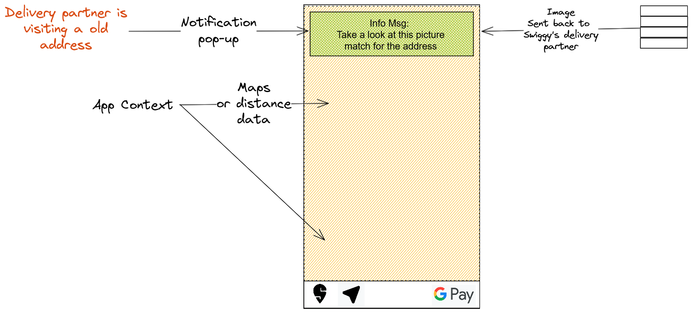

+++
title="Swiggy Case study"
description="Swiggy Case study by Sakshat Shinde - on time delivery deteriorating 🔻10%"
date=2024-06-03

[taxonomies]
tags = ["product"]
categories = ["product-management", "case-study"]

[extra]
math=true 
+++

## Reported Root Causes

Delays by the restaurants, difficulties pin-pointing delivery location, traffic

$$
\text{On time delivery} = 1 - \left( \frac{l_d}{t_d} \right)
$$

$$
\text{where, } \  l_d = \text{No. of late deliveries} \newline \\ t_d = \text{No. of total deliveries}
$$

---

## Affected customers
- Kids craving for some ice cream on the weekend
- My dad, who has taken insulin and is banking on the fact that food will be delivered on-time
- Couples waiting to finally share a meal together - after a long hard day at work
- Teens ordering mid-night snacks to get them through this awful late-night study session
- Every single person who chose swiggy to deal with their hunger, cravings or both

---

## Problem to be solved
On time delivery deteriorating 🔻10% - late deliveries. Improving our most important metric, on-time delivery push it beyond 95%

## Why?
Swiggy’s core business is delivering `perishable products`. Late deliveries lead to multitude of problems, mainly dissatisfaction of the customer, food turning cold and the worst losing a potential recurring customer impacting repeat orders within their [`social graph`](https://hbr.org/2015/02/the-rise-of-social-graphs-for-businesses). Hangry customers are hard to deal with, for both the delivery partners and the business.

---

# Solution
Currently we have three different vectors, 
- Restaurants
- Location Discovery 
- Traffic

We need to figure out how much weight each vector has. Assuming the weights: Location Discovery `50%`, Traffic `30%`, Restaurants handover delays `20%`. I’ll be focusing on tackling location discovery with [Geotagging](https://en.wikipedia.org/wiki/Geotagging). Launch a feature to aggressively collect location-image data for every successful delivery on a new address. <u>The delivery partner would click pictures of the apartment complex, society and the street.</u> As it is only applicable to first time deliveries to a newly encountered address - overtime the overhead will decrease as more and more locations are mapped.

Understanding the above solution, right now we already have sufficient gps data to get the delivery location within a radius of 20-40m. Since India faces a unique geographical challenge where most habitable areas are poorly planned due to the sheer explosive growth the country has gone through. Once we have a vast library of images associated with an address, <u>it’d be easier for the delivery partners to spot the exact apartment, ask for directions from locals, etc.</u> This can be enhanced using AR as the tech develops, think of `Pokémon Go`.

---

---

### Judging the solution
- Measuring customer satisfaction for the delivery time with an in-app pop-up survey
- Improvement in the On Time Delivery metric

### Success metrics to be tracked
- On Time Delivery Rate
- Customer Satisfaction Score for the delivery experience
- Delivery partner arrival time at the customer address after being in the `100m` range
- \# of failed deliveries due to incorrect addresses
- Customer complaints specifically mentioning <u>cold food</u>

> I’d like to lay down a basis for the areas which we need to focus on - to track possible improvements.

<u>Identifying different markets</u>, so we can expand the business model - albeit sticking to delivery. We can start offering warehouses, and lease out our supply vehicles by predicting demand across the year. Say we need 100 trucks to operate our business in Q1, but it might be that in Q2 or Q3 the demand might shrink due to different market conditions - in this case we can leverage our existing infrastructure to generate additional cash flow by leasing it out.

*Metrics to be tracked and improved:*
- Cost (in various parameters: Warehousing, Currency exchange)
- Capacity utilization
- \# of trucks/vehicles grounded (vehicle utilization rate)
- \# of shipments $Q(n-1)$ vs $Q(n)$ and so on
- Customer Backorder Rate (It might be that we leased out our vehicles and now we can’t deliver what customer expects within a timeframe)
- Freight Cost per Unit Shipped (will vary depending on the geography. Eg. India to China is cheap but India to USA is expensive)

Heavy focus on Integration, since I am working at Amdocs for a while. I have noticed that the business AT&T US, has a very tight coupling with Amdocs. It might seem like a good idea but it’s a double edge sword. Regardless, this tight coupling means customers get 1:1 line of direct communication to the org which is providing a service. Our logistics company might do the same - offering our own software stack instead of relying on a 3rd party, yes it means we will burn more cash but it also means that once we get a customer we can tailor the complete experience to our liking, although I don't want to use the term Vendor-Lock in here, that's not what I am suggesting. Cross-selling existing features made for one client can be sold to another client as well increasing the scope of revenue growth.

*Some immediate benefits:*
- Providing customized solutions to each B2B partner, resulting more revenue
- Offering value added services on top of the mains stack, eg. If delivery is canceled, we can track and keep the package in our warehouse until someone else orders the same thing
- Using data analytics to further make our product and entire supply chain more efficient, since it’s our stack we can track everything
- Tracking indirect costs becomes easier
- Heavy integration might make it easier to do OUT-OF-NETWORK SHIPMENTS over time we can track patterns and forecast probable OON shipments

*Metrics to be tracked and improved:*
- Customer satisfaction
- Truck Turning Rate (Due to our customized stack, we can do data analysis on things that affect this metric, and figure out a way to make it better)
- \# of return customer orders, enhancements and customization requests
- Feature adoption rate across clients
- Billing accuracy and shipment details (arrival time, delays etc.)
- Pick & Pack Cycle Time
- Order Accuracy

Some generic metrics to be tracked are - Revenue growth, Profit margin, Market Share. I looked into international shipping, definitely `cannot sum this up in one single blog post.`
